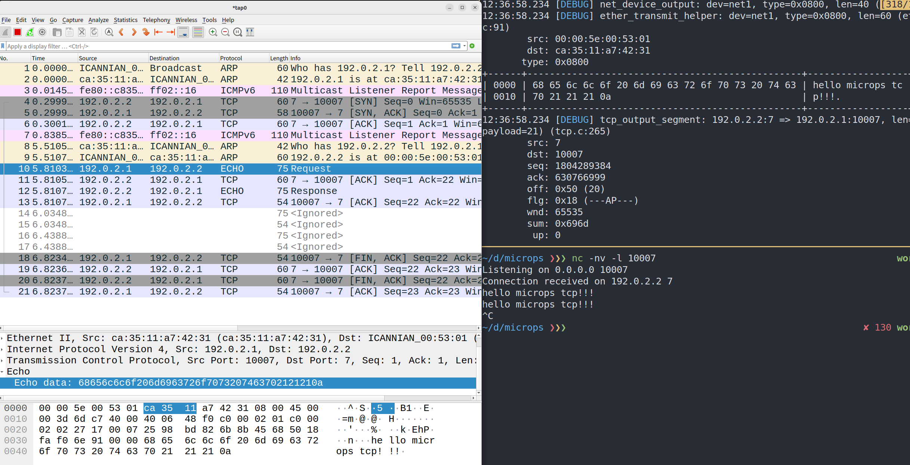

# microps

A learning TCP/IP protocol stack from scratch.
This protocol stack was created at [KlabExpertCamp6](https://klab-hr.snar.jp/jobboard/detail.aspx?id=ceG7Rw98wQU) based on [microps](https://github.com/pandax381/microps).



## How to use

### Setup
Create a TAP device.
In this implementation, microps communicates with the Linux TCP/IP protocol stack by reading and writing to the TAP device.

```bash
# microps <-----> TAP (Linux)
# 192.0.2.2/24    192.0.2.1/24
sudo ip tuntap add mode tap user $USER name tap0
sudo ip addr add 192.0.2.1/24 dev tap0
sudo ip link set tap0 up
```

IP forwarding and NAT are configured to allow microps to communicate with the Internet via Linux.

```bash
# microps <-----> TAP (Linux) <-----> Internet
sudo bash -c "echo 1 > /proc/sys/net/ipv4/ip_forward"
sudo iptables -A FORWARD -o tap0 -j ACCEPT
sudo iptables -A FORWARD -i tap0 -j ACCEPT
sudo iptables -t nat -A POSTROUTING -s 192.0.2.0/24 -o <INTERFACE_CONNECTED_TO_INTERNET> -j MASQUERADE
```

### Build & Run

```bash
make

wireshark -i tap0
# or
tcpdump -i tap0
```

#### Example1: Ping to Google Public DNS (8.8.8.8)

```bash
./test/step17.exe
```

#### Example2: Echo server
Listen for an incoming connection on port 10007.
```bash
nc -nv -l 10007
```

Connect to nc.
```bash
./test/step28.exe
```

Enter you message on nc.
```bash
$ nc -nv -l 10007
Listening on 0.0.0.0 10007
Connection received on 192.0.2.2 7
<YOUR MESSAGE>
```

## LICENSE
MIT

## Original Author
[YAMAMOTO Masaya](https://github.com/pandax381)
